# System workflow: health event in, alert out

> This platform is validated on a 100-patient demo subset of MIMIC-IV. Clinical
> narrative is LLM-generated from structured data. Wearable deterioration
> signals are synthetically morphed from healthy-volunteer recordings. The
> engineering is real and the methodology is rigorous; the clinical
> performance figures demonstrate pipeline validity and do not transfer to
> clinical practice (PROJECT_PLAN.md section 17).

Every component below is real and either currently passing tests or verified
live against a running instance (see the phase READMEs linked throughout for
the evidence). Where something is documented but not actually wired — the MQTT
subscriber loop, live pgvector, real FCM push — the diagram says so on the
edge or node itself rather than staying silent, the same standard the rest of
this repo holds itself to (`README.md`'s "What's real vs. what's honestly
scoped"). See [`docs/workflow_simple.md`](workflow_simple.md) for a shorter
diagram tracing one composite event straight through to an alert, without the
full component inventory.

## The two things to understand before reading the diagram

**1. `EscalationLoop` is one class with two entry points, and both run the
same score → alert code.** `on_observation()` is triggered per Kafka message
(the async, always-on path — throttled to 15 stream-minutes per patient so a
64Hz wearable stream doesn't hammer risk-engine). `run_now()` is a one-shot
synchronous call for a caller that already has a complete vitals dict —
`event-studio`'s composed events — and skips the throttle since there is no
stream to throttle. Same score → alert sequence, same real services, same
order, either way (`services/stream-processor/escalation.py`).

**2. Exactly one place calls `notification-gateway` on a new alert:
`alert-service` itself.** This was not always true, and finding out it wasn't
is worth stating plainly. `alert-service`'s own `POST /alerts` handler already
notified the dashboard internally on every genuinely new alert. Wiring a
guarded SMS sender into `notification-gateway` (`services/common/sms.py`, on
every high-severity notification) surfaced that `stream-processor`'s
`EscalationLoop` was independently calling `/notify` a *second* time after
alert-service returned — every real alert this project has ever raised
through the streaming path was already notifying the dashboard twice, and
would have paged a phone twice. Fixed by making alert-service the one caller;
it now returns the notification result (SMS included) embedded in its own
response, and `EscalationLoop` reads that back rather than requesting a
second one. See `escalation.py`'s module docstring and
`VALIDATION_REPORT.md`'s "F7" note for the fuller account.

Both paths — the always-on deterministic one and the on-demand agentic one
(`agent-orchestrator`'s six-node LangGraph, run per patient, not per
observation, because it makes a real LLM call) — still share the same
`should_escalate()` predicate (the orange hexagon below) so they can never
disagree about whether to escalate. That sharing is itself the fix for an
earlier bug (review finding F1): an earlier version inlined the rule in one
place only and silently dropped one of NEWS2's two escalation triggers.

## The diagram

```mermaid
%%{init: {"flowchart": {"rankSpacing": 55, "nodeSpacing": 28, "curve": "monotoneY"}}}%%
flowchart TD
    %% ============ INPUT LAYER ============
    subgraph INPUTS["① Event sources — all producers satisfy one Observation contract"]
        direction LR
        ICU["real_event_replay.py\nICU monitor replay"]
        WR["wearable_replay.py\nhealthy volunteer, never alerts"]
        MORPH["morphing.py\nsynthetic deterioration"]
        WATCH["Wear OS watch\nBLE GATT peripheral"]
        EDGE["edge_agent\nfeatures + SQLite outbox"]
        STUDIO["event-studio (browser)\ncompose severity → event\n(local should_escalate preview)"]
        WATCH -->|BLE notify| EDGE
    end
    OBS{{"Observation contract\npatient_ref · LOINC code · value · quality_flags"}}
    ICU --> OBS
    WR --> OBS
    MORPH --> OBS
    EDGE --> OBS
    STUDIO --> OBS

    %% ============ INGESTION ============
    subgraph INGEST["② Ingestion"]
        GW["ingest-gateway :8000\nREST+MQTT · schema validation · API-key auth"]
        MQTTB[("EMQX broker")]
        KAFKA[("Kafka  raw.* topics")]
    end
    OBS -->|"HTTPSink\nPOST /observations/batch"| GW
    EDGE -.->|MqttPublisher| MQTTB
    MQTTB -.->|"not wired: no subscriber loop"| GW
    GW -->|KafkaPublisher| KAFKA

    %% ============ ESCALATION CORE — one class, two entry points ============
    subgraph STREAM["③ EscalationLoop — one class, two entry points, always the same score→alert sequence"]
        SP["stream-processor :8003\nKafkaConsumerThread\nrolling stats · trend slopes · HRV · event-rate norm (R4)"]
        WIN[("windowed store\nlatest + rolling stats /channel")]
        LOOP{{"EscalationLoop\non_observation() — per Kafka message, throttled 15 stream-min/patient\nrun_now() — one-shot, called directly, no throttle"}}
        SP --> WIN --> LOOP
    end
    KAFKA --> SP
    STUDIO ==>|"run_now(vitals) — realtime,\nbypasses Kafka"| LOOP

    RE_LIVE["risk-engine :8001\nPOST /score/live\n(streamed vitals, no stay_id)"]
    LOOP -->|"① vitals"| RE_LIVE
    RE_LIVE -.->|"② news2 + escalation_recommended"| LOOP

    PRED{{"warehouse/news2.py — should_escalate()\none definition — also imported by event-studio's preview\n3 limbs: ICU tier=high (E5) · red non-GCS param (F1)\n· GCS falls ≥2pts/4h off sedation"}}
    RE_LIVE -.->|imports| PRED

    %% ============ ALERTING — alert-service is the ONE caller of notify ============
    subgraph ALERTOUT["④ Alerting — alert-service is the ONLY caller of notification-gateway on a new alert"]
        AS["alert-service :8005\nraise · dedupe (4h clock, R6)\nsuppress · escalate · ack"]
        ASDB[("SQLite AlertStore")]
        NG["notification-gateway :8006\nWebSocket · FCM push · guarded SMS\n(services/common/sms.py, high severity)"]
        AS -->|"internally, on a new alert"| NG
        AS --> ASDB
    end
    LOOP -->|"POST /alerts"| AS
    AS -.->|"embedded in response\n(F7: fixed a double-notify bug)"| LOOP
    SMS(("guarded Twilio sender\ndry-run unless SMS_MODE=live\nforces [SYNTHETIC DRILL]"))
    PHONE(("clinician's phone"))
    NG -->|"severity == high"| SMS -.-> PHONE

    %% ============ SCORING CORE ============
    subgraph SCORE["⑤ Scoring core — risk-engine :8001, warehouse-backed"]
        RE_DET["GET /score/{stay}/{hour}\nward+ICU NEWS2 · SOFA"]
        RE_ML["POST /score/ml/{stay}/{hour}\nLightGBM 0.493 AUPRC + SHAP"]
    end
    RE_DET -.->|imports| PRED

    %% ============ ON-DEMAND AGENTIC PATH ============
    subgraph AGENT["⑥ On-demand agentic path — agent-orchestrator :8008 (LangGraph, per patient not per observation)"]
        direction LR
        A1["VitalsMonitor\nreads hourly_grid"]
        A2["LabInterpreter\nreads abnormal labs"]
        A3["RiskScorer\nrelays risk-engine\nVERBATIM"]
        A4["ContextRetriever\nqueries rag-service"]
        A5["EscalationDecider\nPOLICY FIRST;\nLLM asked after"]
        A6["Summarizer\nLLM from state only"]
        A1 --> A2 --> A3 --> A4 --> A5 --> A6
    end
    A3 -->|"GET /score/{stay}/{hour}"| RE_DET
    A5 -.->|"imports, same fn as RE_LIVE"| PRED

    subgraph KNOW["Knowledge + LLM"]
        RAG["rag-service :8004\nTF-IDF (not yet pgvector)"]
        RAGCORPUS[("notes_synth notes\n+ guideline corpus")]
        LLM(("LLM backend\nGroq gpt-oss-120b (used)\nclaude-sonnet-5 (target)"))
        RAGCORPUS --> RAG
    end
    A4 -->|"GET /search?q&k=3"| RAG
    STUDIO ==>|"GET /search — direct,\nonly if escalated"| RAG
    A5 -.->|"advisory only —\nnever overrides"| LLM
    A6 --> LLM

    WH[("DuckDB warehouse\nhourly_grid · news2 · labevents")]
    A1 -.->|reads| WH
    A2 -.->|reads| WH
    RE_DET -.->|reads| WH
    RE_ML -.->|reads| WH

    AUDIT[("hash-chained audit log\nSQLite/Postgres — tamper-evident")]
    A1 & A2 & A3 & A4 & A5 -.-> AUDIT
    A6 -.->|"{input_hash, tool_calls, output,\nmodel_id, tokens, latency_ms}"| AUDIT

    %% ============ CONSUMERS ============
    subgraph OUT["⑦ Consumers"]
        CAPI["clinician-api :8007\nBFF · SMART-on-FHIR JWT"]
        UI["Clinician dashboard (React)\nward · patient · alert inbox"]
    end
    RE_DET -->|"/risk"| CAPI
    RE_ML -->|"/risk/.../ml"| CAPI
    AS <-->|"/alerts*, ack/escalate/suppress"| CAPI
    RAG -->|"/search (audited)"| CAPI
    A6 -->|"/assessment ← POST /run"| CAPI
    CAPI -.-> AUDIT
    CAPI <-->|"REST, polled"| UI
    NG ==>|"WS /ws/dashboard"| UI

    %% ============ FHIR + REPORTS ============
    subgraph EXPORT["⑧ Clinical export"]
        FHIRMAP["fhir-mapper :8002\n11 FHIR R4B mappers"]
        HAPI[("HAPI FHIR server")]
        REPORTS["reports/\nhandover · daily summary · digest"]
        PDF[/"PDF"/]
    end
    FHIRMAP -.->|reads| WH
    FHIRMAP -->|"transaction bundle\n(F2 fixed)"| HAPI
    REPORTS -.->|reads| WH
    REPORTS -->|"same discipline\nas Summarizer"| LLM
    REPORTS --> PDF
    REPORTS -->|"daily-summary only,\nmapper as a library"| HAPI

    %% ============ STYLES ============
    classDef input fill:#dbeafe,stroke:#2563eb,color:#1e3a8a;
    classDef bus fill:#e5e7eb,stroke:#6b7280,color:#111827,stroke-dasharray: 3 3;
    classDef stream fill:#dcfce7,stroke:#16a34a,color:#14532d;
    classDef score fill:#fef9c3,stroke:#ca8a04,color:#713f12;
    classDef agent fill:#ede9fe,stroke:#7c3aed,color:#4c1d95;
    classDef alert fill:#fee2e2,stroke:#dc2626,color:#7f1d1d;
    classDef out fill:#cffafe,stroke:#0891b2,color:#164e63;
    classDef store fill:#f3f4f6,stroke:#9ca3af,color:#1f2937,stroke-dasharray: 2 2;
    classDef pred fill:#fff7ed,stroke:#ea580c,color:#7c2d12,stroke-width:2px;
    classDef demo fill:#fdf4ff,stroke:#c026d3,color:#701a75,stroke-dasharray: 4 2;

    class ICU,WR,MORPH,WATCH,EDGE,STUDIO,OBS input;
    class GW,MQTTB,KAFKA bus;
    class SP,WIN,LOOP,RE_LIVE stream;
    class RE_DET,RE_ML score;
    class A1,A2,A3,A4,A5,A6,RAG,RAGCORPUS,LLM agent;
    class AS,ASDB,NG alert;
    class CAPI,UI,FHIRMAP,HAPI,REPORTS,PDF out;
    class AUDIT,WH store;
    class PRED pred;
    class SMS,PHONE demo;
```

## Reading the diagram

Numbered circles trace one concrete request/response sequence each — the
`EscalationLoop`'s two labelled hops to risk-engine (③) — and the section
headers (①-⑧) trace the end-to-end path in order. Dashed edges are
"reads/imports/best-effort," not the primary control flow; double-line edges
are the two paths that bypass the normal ranking of the diagram — `event-studio`
calling `EscalationLoop.run_now()` and `rag-service` directly, and the
dashboard's persistent WebSocket. Colour groups by role, not by service: blue
= producers, grey = bus/ingestion, green = the always-on path, yellow = the
shared warehouse-backed scoring core, violet = the agentic path and everything
it calls, red = alerting (now including SMS), teal = consumer-facing services,
orange = the one shared policy function, magenta = the guarded SMS sender and
its one destination. Grey cylinders are stores (Kafka, the warehouse, the
audit log, the corpus) — nothing computes inside them.

## Honest gaps, shown on the diagram itself rather than glossed over

- **MQTT publish works; the subscriber side doesn't exist yet.** `edge_agent`
  can publish to a real EMQX broker with client-cert auth, but nothing
  subscribes and forwards into `ingest-gateway` — `--sink http` is the path
  every producer actually uses today (`edge/edge_agent/README.md`).
- **`rag-service` is real TF-IDF retrieval, not the live pgvector query the
  Postgres `vector` extension is already provisioned for**
  (`infra/compose/README.md`).
- **FCM push is a `NoopPushSender`.** The real HTTP v1 call is implemented;
  no FCM project credentials exist in this environment
  (`services/README.md`).
- **SMS is a demo shortcut, stated as one in `services/common/sms.py`'s own
  docstring.** `notification-gateway` is the real paging route now (moved
  there from `event-studio`, which only ever composes a text preview); SMS
  itself still talks to a real Twilio account only when `SMS_MODE=live` is
  explicitly set, defaults to dry-run, and forces every message to carry
  `[SYNTHETIC DRILL]`.

## Where each piece is documented in depth

| Diagram section | Detail |
|---|---|
| ① Event sources | [`simulators/README.md`](../simulators/README.md), [`edge/edge_agent/README.md`](../edge/edge_agent/README.md), [`edge/wear_os/README.md`](../edge/wear_os/README.md), [`services/event-studio/README.md`](../services/event-studio/README.md) |
| ②③④ Ingestion, escalation, alerting | [`services/README.md`](../services/README.md), [`infra/compose/README.md`](../infra/compose/README.md) (real Kafka wiring, three bugs found getting it there) |
| The shared predicate | `warehouse/news2.py` module docstring, [`warehouse/news2_report.md`](../warehouse/news2_report.md) |
| ⑥ Agentic path | [`services/README.md`](../services/README.md)'s "The agent graph" section, `VALIDATION_REPORT.md`'s audit-chain and F1 sections |
| ⑦ Consumers | [`ui/README.md`](../ui/README.md) |
| ⑧ Clinical export | [`reports/README.md`](../reports/README.md), `infra/compose/README.md`'s HAPI FHIR section |
| Scoring numbers | [`ml/README.md`](../ml/README.md), [`ml/evaluation/report.md`](../ml/evaluation/report.md) |
| Two arms, one policy gap | [`docs/two_arm_alignment.md`](two_arm_alignment.md) |
| The double-notify bug (F7) | `services/stream-processor/escalation.py` and `services/alert-service/app.py` module docstrings, `VALIDATION_REPORT.md`'s scope note |
