# System workflow: health event in, alert out

> This platform is validated on a 100-patient demo subset of MIMIC-IV. Clinical
> narrative is LLM-generated from structured data. Post-discharge signals are real
> MIMIC physiology passed through a simulated home sensor layer, and the
> post-discharge model is a transfer from ICU data with no post-discharge labels. The
> engineering is real and the methodology is rigorous; the clinical
> performance figures demonstrate pipeline validity and do not transfer to
> clinical practice (PROJECT_PLAN.md section 17).

Every component below is real and either currently passing tests or verified
live against a running instance (see the phase READMEs linked throughout for
the evidence). Where something is documented but not actually wired — live
pgvector, real FCM push — the diagram says so on the edge or node itself
rather than staying silent, the same standard the rest of this repo holds
itself to (`README.md`'s "What's real vs. what's honestly scoped"). See
[`docs/workflow_simple.md`](workflow_simple.md) for a shorter diagram tracing
one composite event straight through to an alert, without the full component
inventory.

This page carries **two** diagrams. The first is the runtime path — an event
arrives, a score comes back, an alert goes out. The second, further down, is the
**offline pipeline** that builds the warehouse and the model the first one reads:
where the data comes from, how the model is trained and evaluated, and which arms
were measured and rejected on the way.

## The two things to understand before reading the diagram

**1. `EscalationLoop` is one class with two entry points, and both run the
same score → alert code.** `on_observation()` is triggered per Kafka message
(the async, always-on path — throttled to 15 stream-minutes per patient so a
high-rate home-kit stream doesn't hammer risk-engine). `run_now()` is a one-shot
synchronous call for a caller that already has a complete vitals dict —
`event-studio`'s composed events — and skips the throttle since there is no
stream to throttle. Same score → alert sequence, same real services, same
order, either way (`services/stream-processor/escalation.py`).

**2. Exactly one place calls `notification-gateway` on a new alert:
`alert-service` itself.** This was not always true, and finding out it wasn't
is worth stating plainly. `alert-service`'s own `POST /alerts` handler already
notified the dashboard internally on every genuinely new alert. Wiring a
guarded SMS sender into `notification-gateway` (`services/common/sms.py`, on
every high-severity notification) surfaced that `stream-processor`'s
`EscalationLoop` was independently calling `/notify` a *second* time after
alert-service returned — every real alert this project has ever raised
through the streaming path was already notifying the dashboard twice, and
would have paged a phone twice. Fixed by making alert-service the one caller;
it now returns the notification result (email and SMS included) embedded in
its own response, and `EscalationLoop` reads that back rather than requesting
a second one. See `escalation.py`'s module docstring and
`VALIDATION_REPORT.md`'s "F7" note for the fuller account.

**Paging has two independent channels, not one — email and SMS — and neither
is "instead of" the other in code.** Both are attempted, unconditionally, on
every high-severity notification (`services/common/email.py`,
`services/common/sms.py`, both dry-run by default, both guarded identically).
Which one an operator actually sees fire is a credentials question: email
needs only a free SMTP account (a Gmail app password covers it), so it is the
channel this project demonstrates live; SMS needs a funded Twilio account, so
it stays wired and independently configurable for whenever that exists.

Both paths — the always-on deterministic one and the on-demand agentic one
(`agent-orchestrator`'s eight-node LangGraph, run per patient, not per
observation, because it makes a real LLM call) — still share the same
`should_escalate()` predicate (the orange hexagon below) so they can never
disagree about whether to escalate. That sharing is itself the fix for an
earlier bug (review finding F1): an earlier version inlined the rule in one
place only and silently dropped one of NEWS2's two escalation triggers.

**`event-studio` can reach both paths from one click, but never conflates
them.** Its composed vitals only ever drive the fast path above
(`run_now()`) — `agent-orchestrator`'s own nodes read a real warehouse
`(stay_id, hour)` a browser-composed patient does not have, so composed
vitals never enter the agent graph. Separately, picking one of the demo
cohort's real stays (`GET /patients`) also fires `agent-orchestrator POST
/run` for that stay's real chart — the third double-line edge below — as an
independent question, reported in its own panel rather than presented as the
agent reasoning about the composed vitals (`services/event-studio/README.md`).

## The diagram

```mermaid
%%{init: {"flowchart": {"rankSpacing": 55, "nodeSpacing": 28, "curve": "monotoneY"}}}%%
flowchart TD
    %% ============ INPUT LAYER ============
    subgraph INPUTS["① Event sources — all producers satisfy one Observation contract"]
        direction LR
        ICU["real_event_replay.py<br/>ICU monitor replay"]
        WR["home_kit_stream.py<br/>real deterioration, simulated device"]
        WATCH["Wear OS watch<br/>BLE GATT peripheral"]
        EDGE["edge_agent<br/>features + SQLite outbox"]
        STUDIO["event-studio (browser)<br/>compose severity → event<br/>(local should_escalate preview)"]
        WATCH -->|BLE notify| EDGE
    end
    OBS{{"Observation contract<br/>patient_ref · LOINC code · value · quality_flags"}}
    ICU --> OBS
    WR --> OBS
    EDGE --> OBS
    STUDIO --> OBS

    %% ============ INGESTION ============
    subgraph INGEST["② Ingestion"]
        GW["ingest-gateway :8000<br/>REST+MQTT · schema validation · API-key auth"]
        MQTTB[("EMQX broker")]
        KAFKA[("Kafka  raw.* topics")]
    end
    OBS -->|"HTTPSink<br/>POST /observations/batch"| GW
    EDGE -->|MqttPublisher| MQTTB
    MQTTB -->|"mqtt_subscriber.py<br/>(MQTT_HOST)"| GW
    GW -->|KafkaPublisher| KAFKA

    %% ============ ESCALATION CORE — one class, two entry points ============
    subgraph STREAM["③ EscalationLoop — one class, two entry points, always the same score→alert sequence"]
        SP["stream-processor :8003<br/>KafkaConsumerThread<br/>rolling stats · trend slopes · HRV · event-rate norm (R4)"]
        WIN[("windowed store<br/>latest + rolling stats /channel")]
        LOOP{{"EscalationLoop<br/>on_observation() — per Kafka message, throttled 15 stream-min/patient<br/>run_now() — one-shot, called directly, no throttle"}}
        SP --> WIN --> LOOP
    end
    KAFKA --> SP
    STUDIO ==>|"run_now(vitals) — realtime,<br/>bypasses Kafka"| LOOP

    RE_LIVE["risk-engine :8001<br/>POST /score/live<br/>(streamed vitals, no stay_id)"]
    LOOP -->|"① vitals"| RE_LIVE
    RE_LIVE -.->|"② news2 + escalation_recommended"| LOOP

    PRED{{"warehouse/news2.py — should_escalate()<br/>one definition — also imported by event-studio's preview<br/>3 limbs: ICU tier=high (E5) · red non-GCS param (F1)<br/>· GCS falls ≥2pts/4h off sedation"}}
    RE_LIVE -.->|imports| PRED

    %% ============ ALERTING — alert-service is the ONE caller of notify ============
    subgraph ALERTOUT["④ Alerting — alert-service is the ONLY caller of notification-gateway on a new alert"]
        AS["alert-service :8005<br/>raise · dedupe (4h clock, R6)<br/>suppress · escalate · ack"]
        ASDB[("SQLite AlertStore")]
        NG["notification-gateway :8006<br/>WebSocket · FCM push · guarded email + SMS<br/>(services/common/{email,sms}.py, high severity)"]
        AS -->|"internally, on a new alert"| NG
        AS --> ASDB
    end
    LOOP -->|"POST /alerts"| AS
    AS -.->|"embedded in response<br/>(F7: fixed a double-notify bug)"| LOOP
    EMAILSVC(("guarded SMTP sender<br/>dry-run unless EMAIL_MODE=live<br/>forces [SYNTHETIC DRILL]<br/>live-demonstrated: free SMTP"))
    INBOX(("clinician's inbox"))
    SMS(("guarded Twilio sender<br/>dry-run unless SMS_MODE=live<br/>forces [SYNTHETIC DRILL]<br/>wired, configurable: needs Twilio"))
    PHONE(("clinician's phone"))
    NG -->|"severity == high"| EMAILSVC -.-> INBOX
    NG -->|"severity == high"| SMS -.-> PHONE

    %% ============ SCORING CORE ============
    subgraph SCORE["⑤ Scoring core — risk-engine :8001, warehouse-backed"]
        RE_DET["GET /score/{stay}/{hour}<br/>ward+ICU NEWS2 · SOFA"]
        RE_ML["POST /score/ml/{stay}/{hour}<br/>LightGBM 0.493 AUPRC + SHAP"]
    end
    RE_DET -.->|imports| PRED

    %% ============ ON-DEMAND AGENTIC PATH ============
    subgraph AGENT["⑥ On-demand agentic path — agent-orchestrator :8008 (LangGraph, per patient not per observation)"]
        direction LR
        A1["VitalsMonitor<br/>reads hourly_grid"]
        A2["LabInterpreter<br/>reads abnormal labs"]
        A3["RiskScorer<br/>relays risk-engine<br/>VERBATIM"]
        A4["ContextRetriever<br/>queries rag-service"]
        A5["EscalationDecider<br/>POLICY FIRST;<br/>LLM asked after"]
        A6["Summarizer<br/>LLM from state only"]
        A1 --> A2 --> A3 --> A4 --> A5 --> A6
    end
    STUDIO ==>|"POST /run — real demo<br/>patient only, GET /patients"| A1
    A3 -->|"GET /score/{stay}/{hour}"| RE_DET
    A5 -.->|"imports, same fn as RE_LIVE"| PRED

    subgraph KNOW["Knowledge + LLM"]
        RAG["rag-service :8004<br/>TF-IDF (not yet pgvector)"]
        RAGCORPUS[("notes_synth notes<br/>+ guideline corpus")]
        LLM(("LLM backend<br/>Groq gpt-oss-120b (used)<br/>claude-sonnet-5 (target)"))
        RAGCORPUS --> RAG
    end
    A4 -->|"GET /search?q&k=3"| RAG
    STUDIO ==>|"GET /search — direct,<br/>only if escalated"| RAG
    A5 -.->|"advisory only —<br/>never overrides"| LLM
    A6 --> LLM

    WH[("DuckDB warehouse<br/>hourly_grid · news2 · labevents")]
    A1 -.->|reads| WH
    A2 -.->|reads| WH
    RE_DET -.->|reads| WH
    RE_ML -.->|reads| WH

    AUDIT[("hash-chained audit log<br/>SQLite/Postgres — tamper-evident")]
    A1 & A2 & A3 & A4 & A5 -.-> AUDIT
    A6 -.->|"{input_hash, tool_calls, output,<br/>model_id, tokens, latency_ms}"| AUDIT

    %% ============ CONSUMERS ============
    subgraph OUT["⑦ Consumers"]
        CAPI["clinician-api :8007<br/>BFF · SMART-on-FHIR JWT"]
        UI["Clinician dashboard (React)<br/>ward · patient · alert inbox"]
    end
    RE_DET -->|"/risk"| CAPI
    RE_ML -->|"/risk/.../ml"| CAPI
    AS <-->|"/alerts*, ack/escalate/suppress"| CAPI
    RAG -->|"/search (audited)"| CAPI
    A6 -->|"/assessment ← POST /run"| CAPI
    CAPI -.-> AUDIT
    CAPI <-->|"REST, polled"| UI
    NG ==>|"WS /ws/dashboard"| UI

    %% ============ FHIR + REPORTS ============
    subgraph EXPORT["⑧ Clinical export"]
        FHIRMAP["fhir-mapper :8002<br/>11 FHIR R4B mappers"]
        HAPI[("HAPI FHIR server")]
        REPORTS["reports/<br/>handover · daily summary · digest"]
        PDF[/"PDF"/]
    end
    FHIRMAP -.->|reads| WH
    FHIRMAP -->|"transaction bundle<br/>(F2 fixed)"| HAPI
    REPORTS -.->|reads| WH
    REPORTS -->|"same discipline<br/>as Summarizer"| LLM
    REPORTS --> PDF
    REPORTS -->|"daily-summary only,<br/>mapper as a library"| HAPI

    %% ============ STYLES ============
    classDef input fill:#dbeafe,stroke:#2563eb,color:#1e3a8a;
    classDef bus fill:#e5e7eb,stroke:#6b7280,color:#111827,stroke-dasharray: 3 3;
    classDef stream fill:#dcfce7,stroke:#16a34a,color:#14532d;
    classDef score fill:#fef9c3,stroke:#ca8a04,color:#713f12;
    classDef agent fill:#ede9fe,stroke:#7c3aed,color:#4c1d95;
    classDef alert fill:#fee2e2,stroke:#dc2626,color:#7f1d1d;
    classDef out fill:#cffafe,stroke:#0891b2,color:#164e63;
    classDef store fill:#f3f4f6,stroke:#9ca3af,color:#1f2937,stroke-dasharray: 2 2;
    classDef pred fill:#fff7ed,stroke:#ea580c,color:#7c2d12,stroke-width:2px;
    classDef demo fill:#fdf4ff,stroke:#c026d3,color:#701a75,stroke-dasharray: 4 2;
    classDef live fill:#ecfdf5,stroke:#059669,color:#064e3b,stroke-width:2px;

    class GW,MQTTB,KAFKA bus;
    class SP,WIN,LOOP,RE_LIVE stream;
    class RE_DET,RE_ML score;
    class A1,A2,A3,A4,A5,A6,RAG,RAGCORPUS,LLM agent;
    class AS,ASDB,NG alert;
    class CAPI,UI,FHIRMAP,HAPI,REPORTS,PDF out;
    class AUDIT,WH store;
    class PRED pred;
    class SMS,PHONE demo;
    class EMAILSVC,INBOX live;
```

## Reading the diagram

Numbered circles trace one concrete request/response sequence each — the
`EscalationLoop`'s two labelled hops to risk-engine (③) — and the section
headers (①-⑧) trace the end-to-end path in order. Dashed edges are
"reads/imports/best-effort," not the primary control flow; double-line edges
are the paths that bypass the normal ranking of the diagram — `event-studio`
calling `EscalationLoop.run_now()` and `rag-service` directly for its composed
vitals, `event-studio` separately calling `agent-orchestrator` for a real
picked patient, and the dashboard's persistent WebSocket. Colour groups by role, not by service: blue
= producers, grey = bus/ingestion, green = the always-on path, yellow = the
shared warehouse-backed scoring core, violet = the agentic path and everything
it calls, red = alerting (now including email + SMS), teal = consumer-facing
services, orange = the one shared policy function. The two paging channels get
their own pair each: solid emerald green for the guarded SMTP sender and the
clinician's inbox (the channel this project demonstrates live), dashed magenta
for the guarded Twilio sender and the clinician's phone (wired, configurable,
needs a funded account this environment doesn't have). Grey cylinders are
stores (Kafka, the warehouse, the audit log, the corpus) — nothing computes
inside them.

## The offline pipeline that builds what the runtime reads

The diagram above is the *runtime* path: an event arrives, a score comes back,
an alert goes out. Two of its nodes — the DuckDB warehouse and the LightGBM
model inside `risk-engine` — are not built at runtime at all. They come from a
separate, entirely offline pipeline, and a reader who only sees the diagram
above has no way to tell where they came from or what was rejected on the way.

```mermaid
%%{init: {"flowchart": {"rankSpacing": 50, "nodeSpacing": 26, "curve": "monotoneY"}}}%%
flowchart TD
    %% ============ SOURCE ============
    subgraph SRC["Ⓐ Source — the constraint everything else inherits"]
        DEMO[("MIMIC-IV demo<br/>100 patients · 140 stays<br/>open licence, no credentialing")]
        FULL[["full MIMIC-IV 3.1<br/>credentialed · NOT downloaded<br/>warehouse/fetch_mimic4.py checks for it"]]
    end

    %% ============ WAREHOUSE ============
    subgraph WH["Ⓑ Warehouse — warehouse/"]
        BUILD["build_duckdb.py<br/>load raw tables"]
        CONCEPTS["run_concepts.py<br/>mimic-code derived concepts"]
        GRID["hourly_grid.py<br/>one row per stay-hour<br/>carry-forward + imputation flags"]
        DISEASE["disease.py<br/>dx_chapter · 17 Charlson flags<br/>-> capstone.disease_context"]
        NEWS["news2.py<br/>cohort cut-points + per-chapter<br/>-> should_escalate()"]
        BUILD --> CONCEPTS --> GRID
        CONCEPTS --> DISEASE --> NEWS
    end
    DEMO --> BUILD
    FULL -.->|"would replace, same pipeline"| BUILD

    DB[("DuckDB warehouse<br/>hourly_grid · news2 · labs<br/>disease_context")]
    GRID --> DB
    NEWS --> DB
    DISEASE --> DB

    %% ============ FEATURES + LABELS ============
    subgraph FEAT["Ⓒ Features and labels — ml/features/"]
        ENG["engineer.py<br/>85 features · 36 rolling std/slope<br/>disease set = chronic"]
        LAB["labels.py<br/>composite event · R1 censoring<br/>label_6h / label_12h"]
    end
    DB --> ENG
    DB --> LAB

    %% ============ TRAINING ============
    subgraph TRAIN["Ⓓ Training — ml/models/, subject-grouped CV throughout (F6)"]
        SPLIT["splits.py<br/>repeated grouped stratified CV"]
        MODELS["baselines · logistic · gbm · gru<br/>NEWS2 and SOFA as reference"]
        PROMOTE["serving.py<br/>promoted artefact + manifest<br/>severity cut-points from OOF"]
        SPLIT --> MODELS --> PROMOTE
    end
    ENG --> SPLIT
    LAB --> SPLIT

    %% ============ EVALUATION ============
    subgraph EVAL["Ⓔ Evaluation — ml/evaluation/, every arm scored on real held-out patients"]
        RUNALL["run_all.py<br/>primary + secondary horizons<br/>fairness audit · SHAP"]
        RELY["reliability.py<br/>what narrows the interval:<br/>~725 positive subjects needed, 49 held"]
        DROP["channel_dropout.py + home_kit_transfer.py<br/>what a home kit retains"]
        LEAK["disease_leakage.py<br/>dx_chapter scores at chance — no leak"]
    end
    PROMOTE --> RUNALL
    RUNALL --> RELY
    ENG --> DROP
    ENG --> LEAK

    %% ============ SYNTHETIC — the arm that was rejected ============
    subgraph SYN["Ⓕ Synthetic data — ml/synthetic/ · measured, then rejected"]
        CEIL["evaluation/synthetic_ceiling.py<br/>perfect resampler: no gain<br/>(could not reach mid-fidelity)"]
        WGAN["emr_wgan.py<br/>WGAN-GP · BN generator / LN critic<br/>conditional on the label"]
        PAT["patients.py<br/>whole patients: AR(1) trajectories<br/>derived features RECOMPUTED"]
        QUAL{{"evaluate.py — the paper's battery<br/>DWD 1.44 (paper 0.52-1.56)<br/>TSTR 0.800 vs TRTR 0.827"}}
        PRIV{{"privacy_control.py<br/>membership F1 0.84<br/>chance 0.51 · real 1.0"}}
        WGAN --> QUAL
        PAT --> QUAL
        WGAN --> PRIV
    end
    RELY -->|"the only lever is<br/>more patients"| CEIL
    CEIL -->|"admitted gap:<br/>no mid-fidelity generator"| WGAN
    ENG --> WGAN
    QUAL -.->|"augmented: -0.0006 AUPRC, 10/20<br/>patients: 39 -> 539 subjects, -0.0337"| VERDICT
    VERDICT{{"REJECTED for training.<br/>Not de-identified either —<br/>must not leave the project"}}
    PRIV -.-> VERDICT

    %% ============ WHAT THE RUNTIME CONSUMES ============
    RT(("runtime: risk-engine,<br/>agent-orchestrator, reports<br/>— the diagram above"))
    DB ==>|read at request time| RT
    PROMOTE ==>|"loaded artefact"| RT
    NEWS ==>|"should_escalate() imported"| RT
    VERDICT -. "never reaches" .-> RT

    classDef src fill:#dbeafe,stroke:#2563eb,color:#1e3a8a;
    classDef wh fill:#e5e7eb,stroke:#6b7280,color:#111827;
    classDef feat fill:#fef9c3,stroke:#ca8a04,color:#713f12;
    classDef train fill:#dcfce7,stroke:#16a34a,color:#14532d;
    classDef evalc fill:#ede9fe,stroke:#7c3aed,color:#4c1d95;
    classDef syn fill:#fee2e2,stroke:#dc2626,color:#7f1d1d;
    classDef rt fill:#ccfbf1,stroke:#0d9488,color:#134e4a;
    class DEMO,FULL src;
    class BUILD,CONCEPTS,GRID,DISEASE,NEWS,DB wh;
    class ENG,LAB feat;
    class SPLIT,MODELS,PROMOTE train;
    class RUNALL,RELY,DROP,LEAK evalc;
    class CEIL,WGAN,PAT,QUAL,PRIV,VERDICT syn;
    class RT rt;
```

**Why the rejected arm is on the diagram.** Ⓕ produces nothing the runtime
consumes, and a diagram of what the system *does* would leave it out. It is here
because the question it answers — can synthetic patients substitute for the ones
this cohort does not have — is the first thing a reader asks on seeing Ⓐ, and the
answer is measured rather than assumed. The dashed edge into the runtime is
crossed out on purpose: a synthetic row never enters a training or evaluation set
whose metrics are reported as performance, and the privacy result means the
cohort is not shareable either.

**The one edge that would change everything.** `full MIMIC-IV` in Ⓐ is dashed
because it is not downloaded — it needs PhysioNet credentialing and a signed data
use agreement. Every "wide confidence interval" caveat in this repo traces back
to that single dashed edge, and `warehouse/fetch_mimic4.py` exists to check the
landing zone without ever handling a credential.

## Recently closed

- **MQTT ingress: publish always worked; the subscriber side didn't exist —
  now it does.** `edge_agent`'s `MqttPublisher` publishes to a real EMQX
  broker; `ingest-gateway`'s `mqtt_subscriber.py` (a `paho-mqtt` client
  gated on `MQTT_HOST`, mirroring exactly how `stream-processor`'s Kafka
  consumer thread is gated on `KAFKA_BOOTSTRAP_SERVERS`) now subscribes and
  calls the same real `handle_mqtt_message` the REST path always used —
  verified end to end against a live broker: `edge_agent` publishing in,
  this subscriber receiving it, `GET /mqtt/stats` counting it
  (`services/ingest-gateway/tests/test_mqtt_subscriber.py`, `RUNBOOK.md`
  step 6f-bis).

## Honest gaps, shown on the diagram itself rather than glossed over

- **`rag-service` is real TF-IDF retrieval, not the live pgvector query the
  Postgres `vector` extension is already provisioned for**
  (`infra/compose/README.md`).
- **FCM push is a `NoopPushSender`.** The real HTTP v1 call is implemented;
  no FCM project credentials exist in this environment
  (`services/README.md`).
- **Email and SMS are both demo shortcuts, stated as one in their own module
  docstrings.** `notification-gateway` is the real paging route for both
  (moved there from `event-studio`, which only ever composes a text preview
  of each). Email talks to a real SMTP account only when `EMAIL_MODE=live` is
  explicitly set; SMS talks to a real Twilio account only when `SMS_MODE=live`
  is. Both default to dry-run and force every message to carry
  `[SYNTHETIC DRILL]`. Email is the one this project actually demonstrates
  live — a free SMTP account (e.g. a Gmail app password) is all it needs, no
  billing relationship the way Twilio requires.

## Where each piece is documented in depth

| Diagram section | Detail |
|---|---|
| ① Event sources | [`simulators/README.md`](../simulators/README.md), [`edge/edge_agent/README.md`](../edge/edge_agent/README.md), [`edge/wear_os/README.md`](../edge/wear_os/README.md), [`services/event-studio/README.md`](../services/event-studio/README.md) |
| ②③④ Ingestion, escalation, alerting | [`services/README.md`](../services/README.md), [`infra/compose/README.md`](../infra/compose/README.md) (real Kafka wiring, three bugs found getting it there) |
| The shared predicate | `warehouse/news2.py` module docstring, [`warehouse/news2_report.md`](../warehouse/news2_report.md) |
| Email + SMS paging | [`services/common/email.py`](../services/common/email.py), [`services/common/sms.py`](../services/common/sms.py) |
| ⑥ Agentic path | [`services/README.md`](../services/README.md)'s "The agent graph" section, `VALIDATION_REPORT.md`'s audit-chain and F1 sections |
| `event-studio` → `agent-orchestrator` (real patient only) | [`services/event-studio/README.md`](../services/event-studio/README.md)'s "Optionally, also agent-orchestrator" section |
| MQTT subscriber loop | `services/ingest-gateway/mqtt_subscriber.py` module docstring, [`services/ingest-gateway/tests/test_mqtt_subscriber.py`](../services/ingest-gateway/tests/test_mqtt_subscriber.py) |
| ⑦ Consumers | [`ui/README.md`](../ui/README.md) |
| ⑧ Clinical export | [`reports/README.md`](../reports/README.md), `infra/compose/README.md`'s HAPI FHIR section |
| Scoring numbers | [`ml/README.md`](../ml/README.md), [`ml/evaluation/report.md`](../ml/evaluation/report.md) |
| Ⓐ-Ⓔ Offline pipeline | [`warehouse/README.md`](../warehouse/README.md), [`ml/README.md`](../ml/README.md), [`ml/evaluation/reliability_report.md`](../ml/evaluation/reliability_report.md) |
| Ⓕ Synthetic data, and why it was rejected | [`ml/synthetic/README.md`](../ml/synthetic/README.md), [`ml/synthetic/report.md`](../ml/synthetic/report.md), [`ml/evaluation/synthetic_ceiling_report.md`](../ml/evaluation/synthetic_ceiling_report.md) |
| Post-discharge transfer bound | [`ml/evaluation/home_kit_transfer_report.md`](../ml/evaluation/home_kit_transfer_report.md) |
| The double-notify bug (F7) | `services/stream-processor/escalation.py` and `services/alert-service/app.py` module docstrings, `VALIDATION_REPORT.md`'s scope note |
