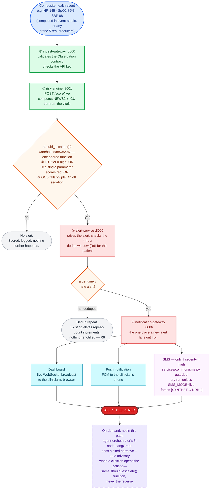

# One composite event, in order, to an alert

> This platform is validated on a 100-patient demo subset of MIMIC-IV. The
> engineering is real and the methodology is rigorous; the clinical
> performance figures demonstrate pipeline validity and do not transfer to
> clinical practice (PROJECT_PLAN.md section 17).

The short version of [`docs/workflow.md`](workflow.md): one composite health
event's actual journey, in the order it actually happens, ending in an alert.
This is the real-time path `event-studio`'s "Send to pipeline" button
exercises synchronously (`EscalationLoop.run_now()`,
`services/stream-processor/escalation.py`) — the same score → alert code the
live Kafka-driven path runs, just called directly instead of triggered by a
consumed message, so a demo gets the outcome back in one response instead of
needing to poll for it.

## The two decisions that actually happen

1. **`should_escalate()` — one function, three limbs, evaluated once, in
   risk-engine.** ICU-recalibrated NEWS2 tier reaching `high` (E5); *or* any
   single non-GCS parameter scoring a red 3 (RCP 2017 — the trigger review
   finding F1 caught the original code silently dropping); *or* GCS falling
   ≥2 points within 4 hours with no sedative running. This is the exact same
   function the on-demand agent's `EscalationDecider` imports, so the two
   paths can never disagree.
2. **A genuinely new alert vs. a dedup repeat — alert-service, aligned to the
   4-hourly clock (R6).** A repeat within the same bucket increments the
   existing alert's `repeat_count` and stops there: no second dashboard
   broadcast, no second push, no second SMS. This used to not be quite true —
   see the fuller diagram's note on finding F7, a real double-notification
   bug found while wiring SMS into this exact path.

## Why SMS is conditional on severity, not on "an alert exists"

Every alert this pipeline raises today is severity `"high"` by construction
(`EscalationLoop`'s `ALERT_TYPE`), so in practice every real alert reaches the
SMS check — but the condition is evaluated on the notification's own severity
field, not assumed, so a future lower-severity alert type would correctly
skip paging a phone for it. It is also dry-run by default regardless: nothing
sends anywhere until `SMS_MODE=live` is set, and every message is forced to
carry `[SYNTHETIC DRILL]` — see [`services/common/sms.py`](../services/common/sms.py).

For the full component inventory — every producer, the async Kafka path
alongside this synchronous one, the agentic reasoning path, FHIR export, and
what's honestly stubbed — see [`docs/workflow.md`](workflow.md).
