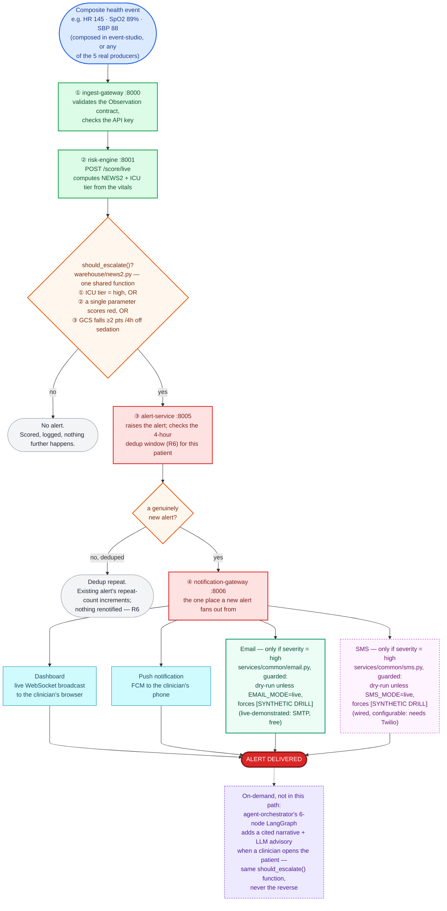

# One composite event, in order, to an alert

> This platform is validated on a 100-patient demo subset of MIMIC-IV. The
> engineering is real and the methodology is rigorous; the clinical
> performance figures demonstrate pipeline validity and do not transfer to
> clinical practice (PROJECT_PLAN.md section 17).

The short version of [`docs/workflow.md`](workflow.md): one composite health
event's actual journey, in the order it actually happens, ending in an alert.
This is the real-time path `event-studio`'s "Send to pipeline" button
exercises synchronously (`EscalationLoop.run_now()`,
`services/stream-processor/escalation.py`) — the same score → alert code the
live Kafka-driven path runs, just called directly instead of triggered by a
consumed message, so a demo gets the outcome back in one response instead of
needing to poll for it.

## The two decisions that actually happen

1. **`should_escalate()` — one function, three limbs, evaluated once, in
   risk-engine.** ICU-recalibrated NEWS2 tier reaching `high` (E5); *or* any
   single non-GCS parameter scoring a red 3 (RCP 2017 — the trigger review
   finding F1 caught the original code silently dropping); *or* GCS falling
   ≥2 points within 4 hours with no sedative running. This is the exact same
   function the on-demand agent's `EscalationDecider` imports, so the two
   paths can never disagree.
2. **A genuinely new alert vs. a dedup repeat — alert-service, aligned to the
   4-hourly clock (R6).** A repeat within the same bucket increments the
   existing alert's `repeat_count` and stops there: no second dashboard
   broadcast, no second push, no second email or SMS. This used to not be
   quite true — see the fuller diagram's note on finding F7, a real
   double-notification bug found while wiring paging into this exact path.

## Two paging channels, one trigger, different credentials

Email and SMS share the identical design: attempted independently and
unconditionally whenever a notification's severity is `"high"` (every alert
this pipeline raises today, by construction — `EscalationLoop`'s
`ALERT_TYPE`), dry-run by default regardless (nothing sends anywhere until
`EMAIL_MODE` / `SMS_MODE=live` is explicitly set), every message forced to
carry `[SYNTHETIC DRILL]`. Neither is "instead of" the other in code — which
one an operator actually sees fire is a credentials question:

- **Email** ([`services/common/email.py`](../services/common/email.py)) is
  the channel this project demonstrates live. It needs only a free SMTP
  account — a Gmail address and an app password covers it, no billing.
- **SMS** ([`services/common/sms.py`](../services/common/sms.py)) stays
  wired and independently configurable for whenever a funded Twilio account
  exists — nothing in the code favours one over the other.

## The SIDE box, made clickable for a real demo patient

The diagram's on-demand box stays on-demand for a real event's own journey —
no production alert waits on an LLM call. `event-studio` (the box this
diagram's `START` node already mentions) can still reach it from the same
click, for a real demo patient specifically: picking one of the 100 real
stays additionally calls `agent-orchestrator POST /run` for that stay's real
chart, independent of whether the composed event above escalated. It is
still never in the alert path — same `should_escalate()`, never the reverse
— just no longer only reachable by hand. See
[`services/event-studio/README.md`](../services/event-studio/README.md).

For the full component inventory — every producer, the async Kafka path
alongside this synchronous one, the agentic reasoning path, FHIR export, and
what's honestly stubbed — see [`docs/workflow.md`](workflow.md).
